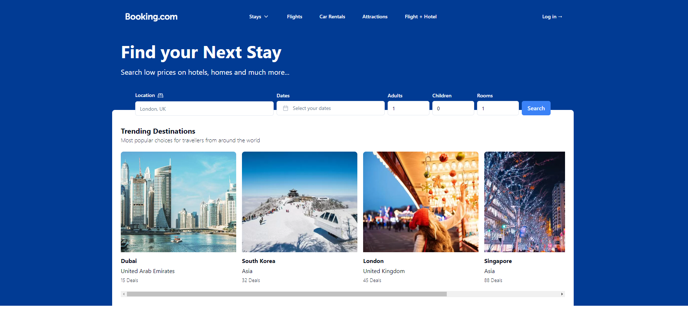

# Booking.com Clone
### [Live Site](https://liamt-bookings-clone.vercel.app)

## Overview
Welcome to a Booking.com Clone. This is a cutting-edge travel platform built with the latest technologies to redefine your booking experience. This project leverages the power of Next.js 14, integrating seamlessly with the Oxylabs Web Scraper API. The combination of React, Shadcn, Tailwind, and Typescript ensures a robust and dynamic application.

## Features
### 1. Modern Stack
- **NEXT.JS 14:** Utilizing the latest features and improvements for a performant and efficient application.
- **React:** Building a responsive and interactive user interface for a seamless booking experience.
- **Shadcn:** Styling components with elegance and precision, enhancing the overall visual appeal.
- **Tailwind:** Employing a utility-first CSS framework for rapid and flexible development.
- **Typescript:** Enhancing code quality and maintainability with static typing.

### 2. Web Scraping Integration
- **Oxylabs Web Scraper API:** Harnessing the power of web scraping to gather real-time data for accurate and up-to-date information.

### 3. Well-Organized Structure
- Maintainable React file and folder structure for easy navigation and future enhancements.

### 4. Responsive Design
- Ensuring a seamless user experience across a variety of devices through responsive design and carefully crafted media queries.

### 5. Engaging User Interface
- Incorporating engaging animations and intricate gradients to enhance user experience and captivate users.
